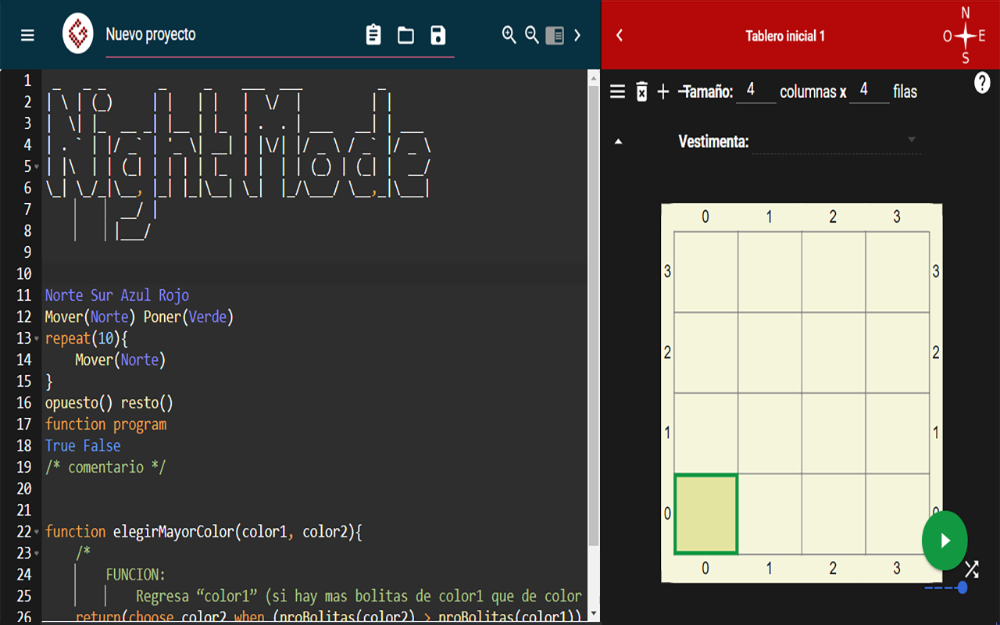

# Gobstones Night Mode

Gobstones Night Mode is a Chrome extension that changes the colors and background on the web IDE for the Gobstones programming language (you can learn more about it [here](https://github.com/gobstones)).

## Installation

[Chrome Web Store](https://chrome.google.com/webstore/detail/eddfllfofdmdhafjdocfkpcknflfgfbm/publish-accepted?authuser=0&hl=en-US)

## Disclaimer

All icons used in the extension are the original Gobstones icons.
